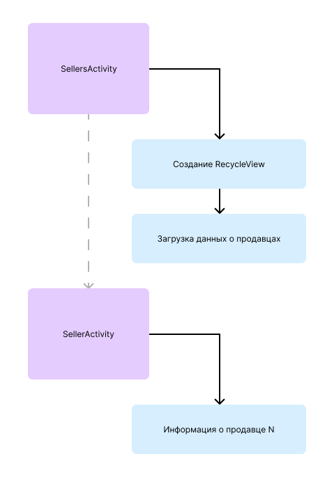

# LeafAgent
[](https://javadoc.io/doc/io.github.holtoon-bit/leafagent)<br><br>
**LeafAgent** — это фреймворк, позволяющий получать сведенья о порядке выполнения частей кода android-приложения (отслеживать события activity, создание объектов, вызовы методов и прочее). LeafAgent составляет дерево вызовов на основе порядка выполнения методов.

LeafAgent можно использовать для выявления багов, анализирования порядка выполнения методов, получения информации о состоянии процессов и т.д. LeafAgent помогает быстрее находить и исправлять баги, выявленные пользователями в момент работы с android-приложением.

## Знакомство с LeafAgent:
1. [Принцип работы](#work)<br>
	1.1.[Пример работы](#example)<br>
	1.2. [Устройство](#how-it-works)
2. [Начать пользоваться](#get-start)
3. [LeafPlugin - плагин для Android Studio](#leaf-plugin)
4. [Пример Android-приложения](#code-example)

## 1. Принцип работы<a id="work"></a>
### 1.1. Пример работы<a id="example"></a>
Для наглядности представим, что мы написали приложение для магазина, в котором храним информацию по всем продавцам. В этом приложение есть две страницы: SellersActivity (список всех продавцов) и SellerActivity (информация по определенному продавцу). Каждая из activity в момент работы выполняет какую-то работу. При открытии SellersActivity, создается объект RecyclerView для отображения всех продавцов и заполняется данными из базы данных. После запуска SellerActivity, появляется дополнительная информации о продавце. Схематично открытие SellersActivity, а затем SellerActivity выглядит следующим образом:

<br>
(Этот пример уже реализован в виде реального android-приложения, см. [Пример Android-приложения](#code-example))
### 1.3. Устройство<a id="how-it-works"></a>
LeafAgent это Gradle Plugin, выполняющийся во время компиляции, преобразуя аннотированную часть байт-кода. Плагин находит классы, аннотированные `@Branch`, и их методы, аннотированные `@Leaf`, и редактирует их байт-код. Поэтому, нужно указывать аннотациями на участке кода, которые вы хотите начать отслеживать.
LeafAgent строит дерево вызовов сохраняемое на устройстве пользователя в файлах приложения в формате json. Для удобства ознакомления с получившимся деревом можно установить плагин для Android Studio (LeafPlugin).
## 2. Начать пользоваться<a id="get-start"></a>

**Javadoc документация:**<br>
[leafagent.agent - javadoc](https://javadoc.io/doc/io.github.holtoon-bit/leafagent)

**Минимальные требования:**<br>
Версия Java: 21

**Установить фреймворк**<br>
Доступен на Central Sonatype: [io.github.holtoon-bit/leafagent](https://central.sonatype.com/artifact/io.github.holtoon-bit/leafagent)<br>
**gradle.build:**
```
plugin {
	id "io.github.holtoon-bit.leafagent.plugin" version("1.0.3")
}
repositories {
	mavenCentral()
}
dependencies { 
	implementation 'io.github.holtoon-bit:leafagent:1.0.3'
}
```

**Добавить аннотации**<br>
Аннотируйте те участки кода, которые хотите отслеживать.
Для классов используйте аннотацию `@Branch`, для их методов `@Leaf`. Если вы отмечаете метод в классе, то сам класс обязательно должен быть аннотирован `@Branch`.

## 3. LeafPlugin - плагин для Android Studio<a id="leaf-plugin"></a>
Для удобной работы с LeafAgent в Android Studio необходимо установить LeafPlugin.<br>
Jetbrains Marketplace: https://plugins.jetbrains.com/plugin/27070-leaf <br>
Репозиторий плагина: [holtoon-bit/LeafPluginIdea](https://github.com/holtoon-bit/LeafPluginIdea).

## 4. Пример Android-приложения<a id="code-example"></a>
Для более легкого старта в освоение LeafAgent, воспользуйтесь реальным примером android-приложения с демонстрацией возможностей плагина. Ознакомиться с примером можно по ссылке: [holtoon-bit/LeafAgent-Android-example](https://github.com/holtoon-bit/LeafAgent-Android-example).
Не забудьте ознакомиться с [LeafPlugin](#leaf-plugin) для удобства работы с LeafAgent.